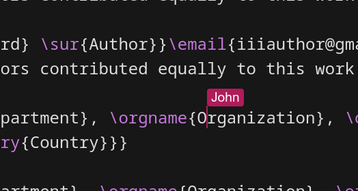
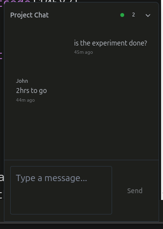
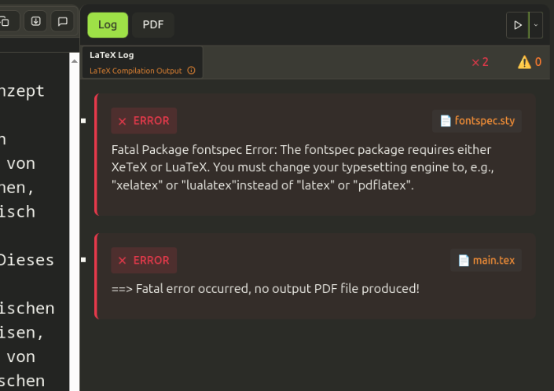
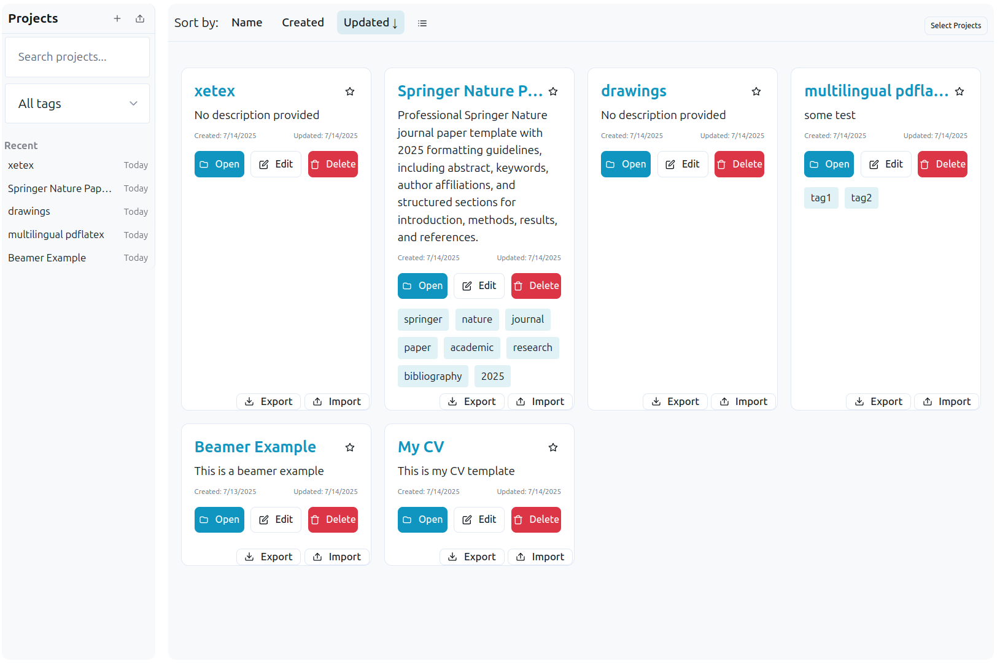
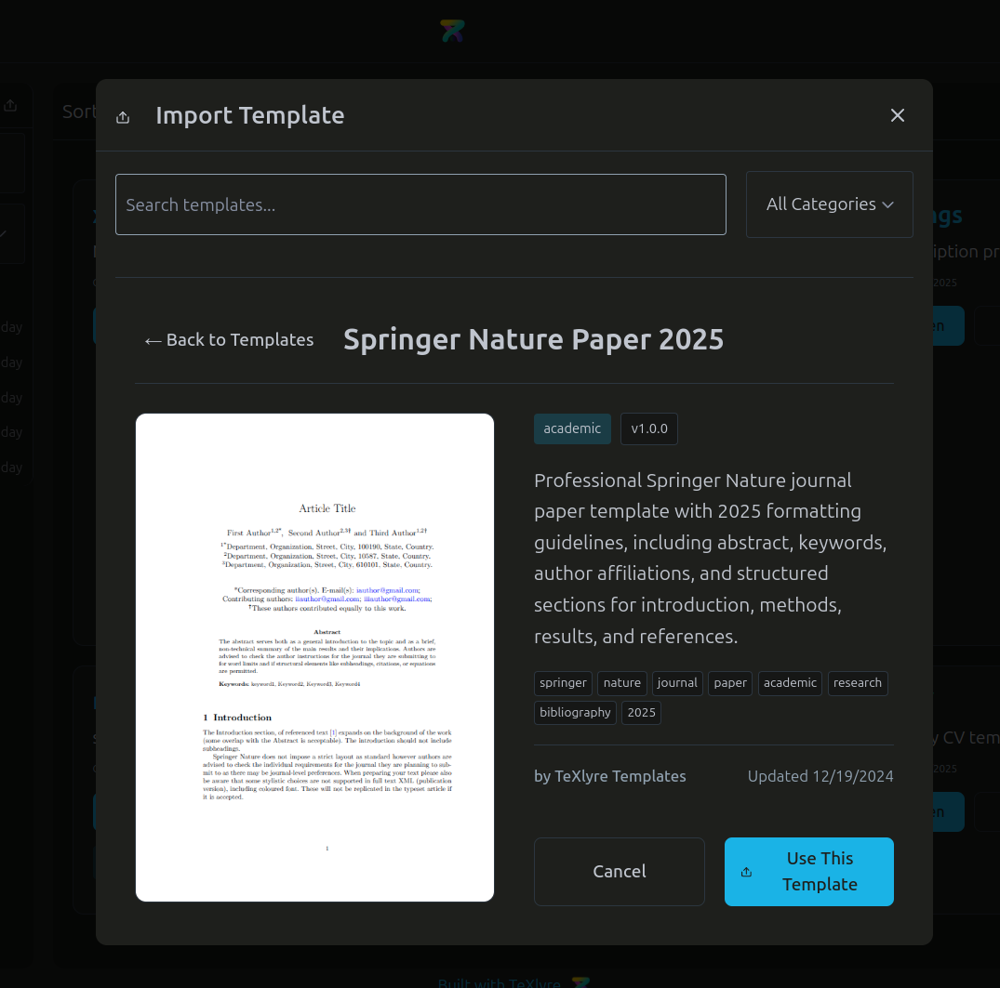
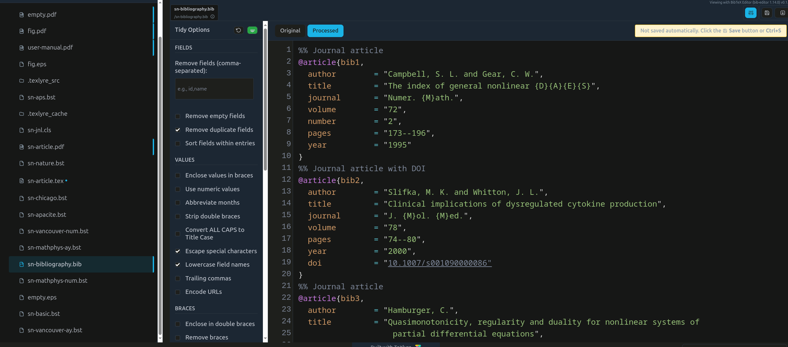

**TeXlyre** is a **[local-first](https://www.inkandswitch.com/essay/local-first/)** real-time LaTeX collaboration platform that enables researchers, academics, and teams to work together on scientific documents. Built with cutting-edge technologies including React, TypeScript, and Yjs, TeXlyre enables collaborative document editing with complete offline capabilities.

<!-- truncate -->

## The Problem with Traditional LaTeX Collaboration

Traditional LaTeX collaboration often involves cumbersome workflows: emailing files back and forth, managing version conflicts manually, or relying on cloud services that don't understand LaTeX's unique requirements. Existing solutions either lack real-time collaboration features or require constant internet connectivity, making them unsuitable for researchers who need to work offline or in low-connectivity environments.

## Enter TeXlyre: A New Paradigm

TeXlyre addresses these challenges with a **local-first architecture** that prioritizes data ownership, offline capability, and real-time collaboration. Unlike traditional cloud-based solutions, TeXlyre stores all your documents locally while enabling instant synchronization with collaborators when needed.

## Key Features That Set TeXlyre Apart

### Real-time Collaboration Without Compromise

TeXlyre's collaboration engine uses **Yjs CRDTs** (Conflict-free Replicated Data Types) for automatic conflict resolution, ensuring that changes from multiple users merge without manual intervention. The platform establishes **WebRTC** peer-to-peer connections, providing ultra-low latency collaboration without routing through external servers.



:::tip Real-time Communication

Beyond document editing, TeXlyre includes integrated chat and commenting systems, enabling collaborators to discuss changes and provide feedback directly within the editing environment.

:::



### In-Browser LaTeX Compilation

One of TeXlyre's most important features is its integration of **SwiftLaTeX WASM engines**, bringing full LaTeX compilation capabilities directly to your browser. No server setup, no external dependencies – just instant compilation with support for both **pdfTeX** and **XeTeX** engines.

The live compilation system provides:
- Immediate feedback with comprehensive syntax highlighting
- Real-time error detection and reporting
- Integrated PDF viewer with advanced navigation
- Side-by-side editing for optimal workflow



:::info Technical Achievement

Running LaTeX compilation entirely in the browser represents a significant technical achievement, eliminating the complexity of server-side compilation while maintaining full feature parity with traditional LaTeX workflows.

:::

### True Local-First Architecture

TeXlyre's **local-first design** ensures that your data remains under your control:

- **Complete offline functionality**: Edit documents without internet connectivity
- **IndexedDB storage**: All documents stored securely in your browser
- **Automatic synchronization**: Resync when connectivity returns  
- **File System Access API**: Direct folder synchronization for external backups
- **Full data portability**: Export and import projects across devices

### Comprehensive File Management

The platform includes a sophisticated file management system supporting:

- Drag-and-drop operations for various file types
- **Document linking** between collaborative documents and static files
- **FilePizza integration** for secure peer-to-peer file sharing
- Support for LaTeX sources, images, data files, and more



## Getting Started with TeXlyre

### Quick Installation

Setting up TeXlyre for development requires Node.js 18+ and a modern browser:

```bash
git clone https://github.com/TeXlyre/texlyre.git
cd texlyre
npm install
npm run dev
```

Navigate to `http://localhost:5173` to access the application. The beauty of TeXlyre is its simplicity – create a new project and start editing immediately, or share a collaboration URL with team members for instant access.

### Template-Based Quick Start

TeXlyre provides various templates to jumpstart your projects, from academic papers to technical documentation.



:::tip Collaboration URLs

TeXlyre uses simple URLs like `http://localhost:5173/#yjs:abc123def456` to enable instant collaboration access. Just share the link with your team members!

:::

## Technical Architecture

### Local-First with Real-Time Sync

TeXlyre's architecture elegantly balances **local-first principles** with real-time collaboration needs:

- **React frontend** provides responsive user interface
- **Yjs documents** stored in IndexedDB for offline-first functionality  
- **WebRTC connections** enable direct peer-to-peer synchronization
- **SwiftLaTeX WASM engines** handle LaTeX compilation in-browser

### Extensible Plugin System

The **plugin architecture** allows for extensive customization:

```typescript
interface ViewerPlugin extends Plugin {
  type: 'viewer';
  canHandle: (fileType: string, mimeType?: string) => boolean;
  renderViewer: React.ComponentType<ViewerProps>;
}
```

Plugins can extend TeXlyre with:
- Custom file viewers and renderers
- LaTeX log processors
- Backup providers
- Theme variations



## Advanced File Synchronization

### Local File System Integration

The File System Access API enables TeXlyre to work directly with local folders, supporting workflows that integrate with cloud storage providers like Dropbox or Google Drive. This maintains compatibility with traditional LaTeX development environments while adding collaborative capabilities.

### Secure Peer-to-Peer Sharing

**FilePizza integration** facilitates secure file transfers between collaborators:

- Large files and images transferred directly between browsers
- Complete privacy with no intermediary servers
- WebRTC-based protocol for maximum security
- Yjs manages file metadata and synchronization state

:::note Technical Implementation

While Yjs handles real-time collaboration (live document editing, cursor tracking, file lists), FilePizza manages the transfer of non-collaborative binary files, creating a comprehensive sharing ecosystem.

:::

## Development and Extensibility

### Development Commands

```bash
npm install            # Install dependencies
npm run dev            # Development server with hot reload
npm run dev:https      # HTTPS development server
npm run build          # Production build
npm run preview        # Preview production build
npm run lint           # Code quality checks
```

### Creating Custom Plugins

The plugin system supports extensive customization. Plugins are automatically discovered when placed in the `extras` directory and registered in `plugins.config.ts`:

```javascript
// Example plugin registration
import { BibEditorPlugin } from './extras/bib-editor';
import { PDFViewerPlugin } from './extras/pdf-viewer';

export const plugins = [
  BibEditorPlugin,
  PDFViewerPlugin,
  // Add your custom plugins here
];
```

## Browser Compatibility and Requirements

TeXlyre leverages modern web technologies for optimal performance:

- **Chrome and Edge**: Full feature support including File System Access API
- **Firefox**: Core collaboration features with limited file system integration  
- **Safari**: Partial compatibility with reduced file system access

:::warning Mobile Support

The File System API hasn't been thoroughly tested on mobile browsers. Use file system backup features with caution on mobile devices.

:::

## Privacy and Security by Design

TeXlyre prioritizes user privacy through its architecture:

### Zero Server Dependency for Content
- **Local-first storage**: All documents remain in your browser
- **Direct peer connections**: No server intermediaries for collaboration
- **No tracking**: Zero analytics, cookies, or data collection

### Minimal Infrastructure Usage
- **Signaling servers**: Only used to establish WebRTC connections
- **GitHub integration**: Optional and requires your own token
- **IP address processing**: Temporary, only for connection establishment

:::info Open Source Infrastructure

TeXlyre's infrastructure components are all open source, enabling complete self-hosting for maximum privacy and control.

:::

## The Technology Stack Behind TeXlyre

TeXlyre builds upon several cutting-edge technologies:

- **[SwiftLaTeX](https://github.com/SwiftLaTeX/SwiftLaTeX/)**: WASM-based LaTeX compilation
- **[Yjs](https://github.com/yjs/yjs)**: Conflict-free collaborative editing
- **[CodeMirror](https://codemirror.net/)**: Advanced text editing interface
- **[FilePizza](https://github.com/kern/filepizza)**: Secure peer-to-peer file transfers
- **React 18+**: Modern, performant user interface
- **TypeScript**: Type-safe development experience

## Future Roadmap and Community

TeXlyre represents just the beginning of local-first collaborative document editing. Future developments include:

- Enhanced mobile browser support
- Additional LaTeX engine integration
- Extended plugin ecosystem
- Improved accessibility features
- Performance optimizations

**Ready to own your LaTeX workflow?** 

🚀 **[Try TeXlyre now](https://texlyre.github.io/texlyre/)** or contribute to the project on GitHub!

Whether you're a researcher collaborating on academic papers, a student working on thesis projects, or a team creating technical documentation, TeXlyre provides the tools you need for efficient, real-time LaTeX collaboration without compromising on privacy or offline capability.