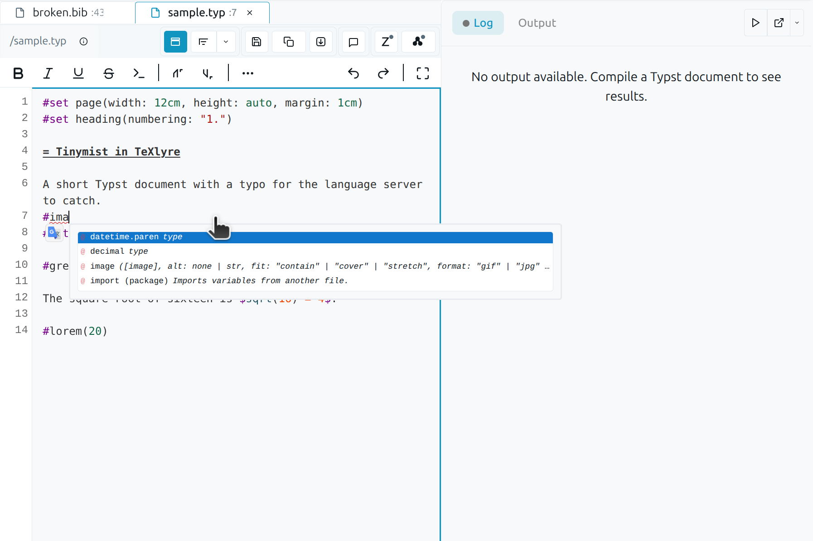
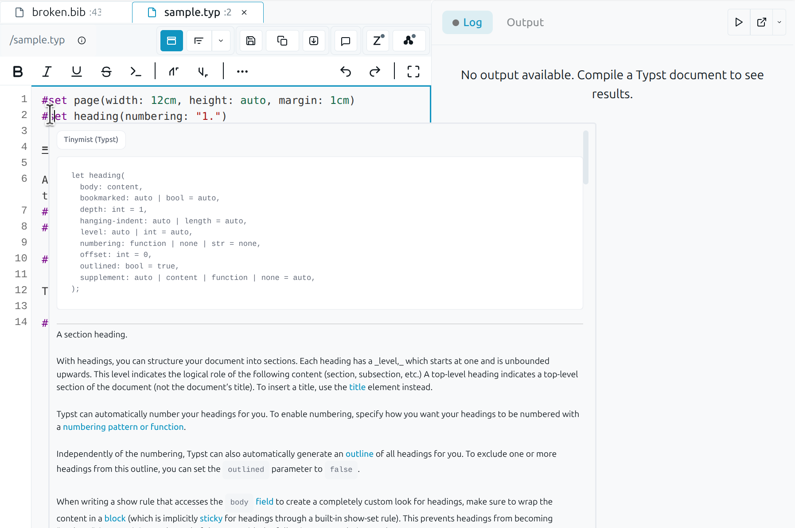
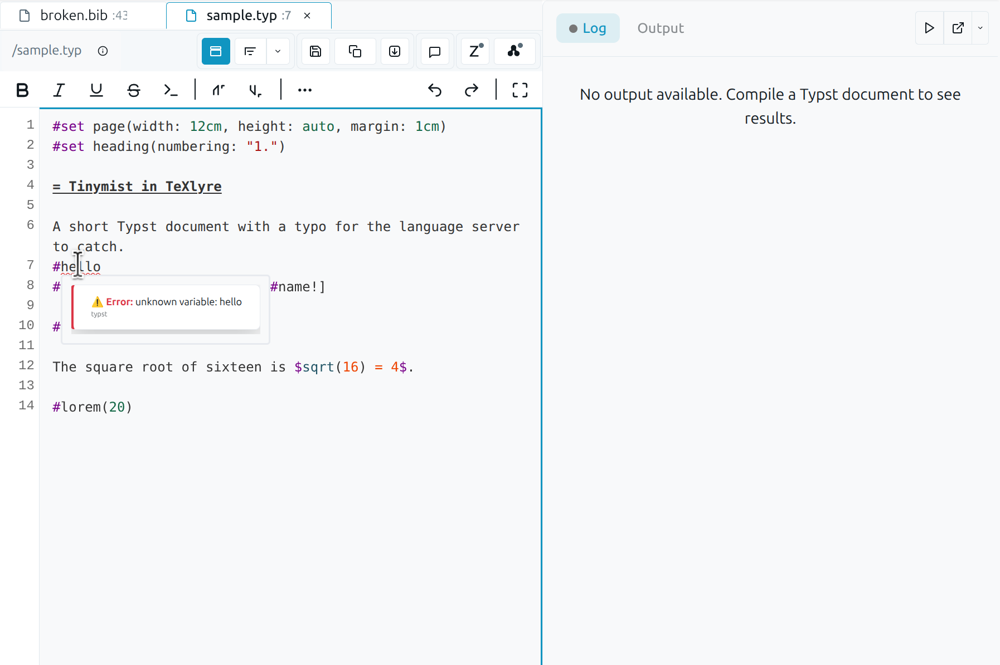
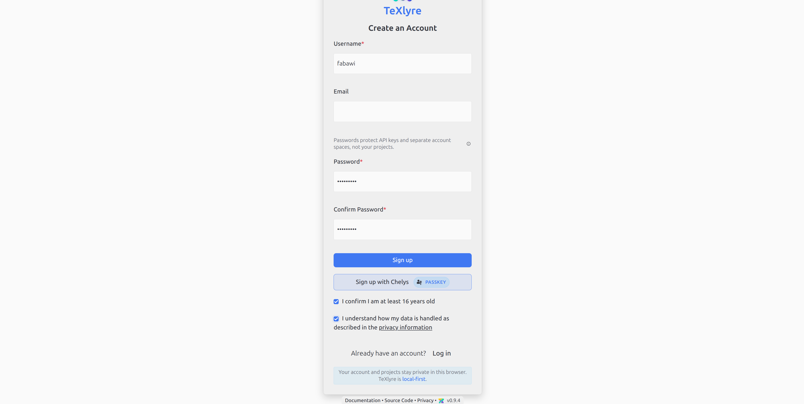
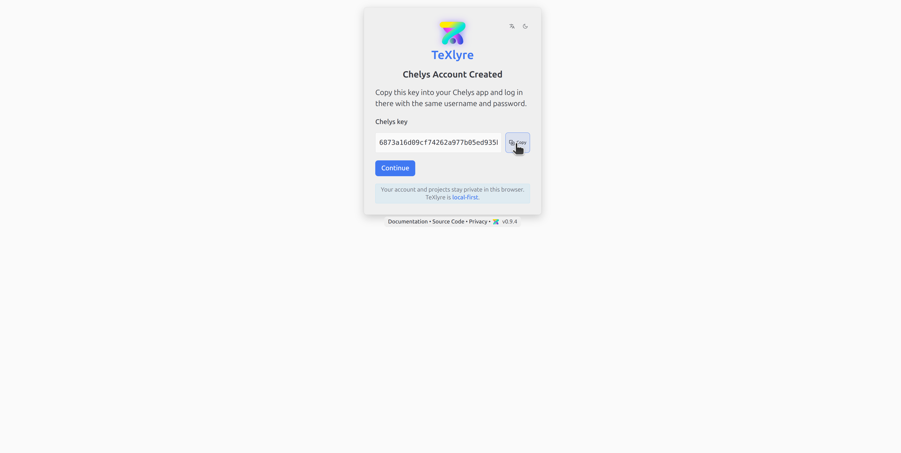
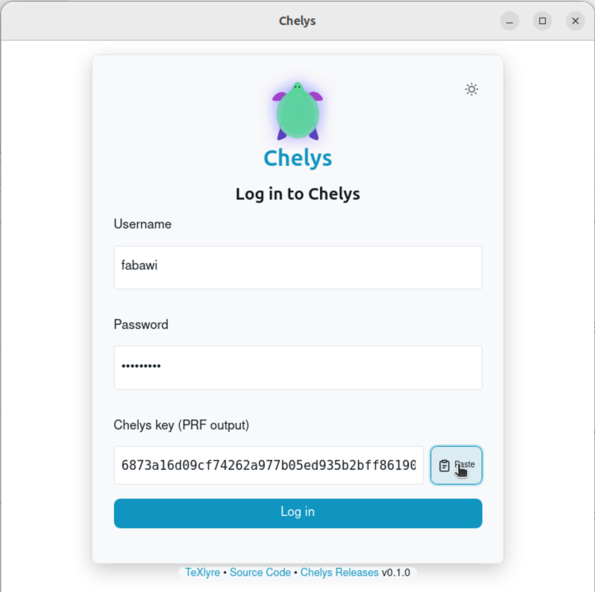

:::info[Part of the NGI0 Core roadmap]

This post reports on Task 2 and the first milestone of Task 4 of TeXlyre's NGI0 Commons grant. For the full project roadmap, see [TeXlyre joins NGI0 Commons](/blog/nlnet-ngi0-funding-overview).

:::

TeXlyre can now use language servers that run on your own machine. Chelys is a local companion application that installs and runs a language server as a background tool and relays its messages to TeXlyre over a local WebSocket connection. Pairing uses your existing TeXlyre identity through a WebAuthn/PRF passkey, which also lets TeXlyre exchange its local storage with other paired instances without Chelys running. A plugin system manages provider containers, so adding a language server means selecting a recipe instead of configuring software by hand. Recipes are available for Tinymist, ltex-ls-plus, harper-ls, and JabRef.

## Background

A browser cannot launch and supervise local processes such as language servers or typesetting engines. TeXlyre already supported the Language Server Protocol on the editor side, but it had no way to install or run a server on the user's machine. Chelys provides that capability as a local companion application. It runs the plugins and exposes them over a local endpoint, while the account pairing is set up to keep the necessary state synchronized across the user's devices.

The work covers two repositories. Each link below shows the full diff for that repository's contribution to this task.

- [chelys](https://github.com/TeXlyre/chelys/commits/nlnet_032026_T2-chelys-lsp-app-plugins): the companion application, covering passkey login, the WebRTC sync layer, and LSP plugin support.
- [texlyre](https://github.com/TeXlyre/texlyre/compare/722aa00a15dd8ac216f7032fdb6b50144587ba30...nlnet_032026_T2-chelys-lsp): passkey login on the application side.


## Milestone 2a: Local LSP relay over WebSocket

Chelys runs a language server as a local background process and bridges it to TeXlyre. The browser connects to a local WebSocket endpoint that Chelys exposes, and Language Server Protocol requests and responses are relayed in both directions between TeXlyre's editor and the local provider. Since the transport is a plain WebSocket address, the relay can also be used on its own, meaning a language server managed manually can be reached by pointing TeXlyre directly at its WebSocket address, following [Using an LSP with TeXlyre](https://texlyre.github.io/docs/lsp-with-texlyre), without Chelys.







*A request originating in the TeXlyre editor travels over the local WebSocket to Chelys, which forwards it to the language server process and returns the response along the same path.*

## Milestone 2b: Standalone passkey login and cross-instance local storage sync

TeXlyre already synchronized project data between instances over WebRTC, scoped by project links. Logging in with the Chelys passkey extends this to user-level data. The passkey's PRF output derives a room identifier, and two TeXlyre instances signed in with the same passkey exchange their local storage (settings, properties, records, and secrets) over that room. This runs in the browser over WebRTC and does not require Chelys. The Chelys app remains responsible for installing and running the plugins.

:::warning[Signaling requires connectivity]

The storage exchange relies on WebRTC for peer connections, which by default uses the signaling server at `ywebrtc.texlyre.org`. Paired instances therefore cannot exchange data while offline. To run fully offline, host a local `y-webrtc` signaling server (see [texlyre-infrastructure](https://github.com/TeXlyre/texlyre-infrastructure)) and set its endpoint in both TeXlyre and Chelys.

:::

The room is derived from the user's username, password, and the WebAuthn/PRF passkey, and credentials are stored in the operating system's native keychain. Synchronization uses Yjs CRDTs over WebRTC with no central server holding the data, and a presence indicator shows which devices are connected.


*Once paired, instances share an encrypted account room and exchange local storage over WebRTC; the presence indicator reflects the devices currently connected.*

## Milestone 4a: Provider plugin system

Providers are packaged as **recipes**: declarative descriptions of a background tool and how to run it. The plugin system installs, updates, and removes provider containers and resolves their dependencies, so adding a language server does not require manual software setup. A recipe runs either as a native system process or inside a Docker container; Docker mode requires a Docker installation available on the system. Ready-made recipes are published at [chelys-recipes](https://texlyre.github.io/chelys-recipes), covering Tinymist for Typst, ltex-ls-plus and harper-ls for prose and grammar checking, and JabRef for BibTeX.


### Bridging a TCP-only server: JabRef

Most recipes run a language server that communicates through LSP over standard input and output. JabRef's language server, However, `jabls` only transports over a TCP socket. The recipe runs `jabls` as a local TCP server and bridges it to a WebSocket that TeXlyre can reach, using `socat` to connect the TCP socket to standard streams and `lsp-ws-proxy` to expose those streams as a WebSocket:

```
TeXlyre  ⇄ WebSocket ⇄  lsp-ws-proxy  ⇄ stdio ⇄  socat  ⇄ TCP ⇄  jabls -p 2087
```

`jabls` is the same component that supports JabRef's official VS Code extension, run standalone here and bridged to TeXlyre. It provides BibTeX and BibLaTeX integrity diagnostics for `.bib` files, reporting consistency, citation-key, and formatting problems as the file is edited. The diagnostics are read-only integrity checks and the server does not modify the `.bib` file.

The recipe exposes a single user-editable variable, `wsPort` (default `7021`), the port the WebSocket proxy listens on. The internal `jabls` TCP port is fixed at `2087` inside the container and is not exposed. Changing `wsPort` updates the run command, the Docker port mapping, and the transport URL that Chelys injects into TeXlyre. The recipe supports three modes: Docker, which builds a self-contained image bundling Java 21, JBang, `socat`, and the proxy; System, which runs the same bridge from a host toolchain; and Connect, which attaches to a bridge already listening on `wsPort`. All modes transmit the LSP json recipe for that plugin to TeXlyre over WebRTC.

## Walkthrough: from pairing to live diagnostics

The following steps walk through the install to live diagnostics from a local language server, using JabRef as the example provider.

1. Download and install Chelys for your platform from the [v0.1.0 release](https://github.com/TeXlyre/chelys/releases/tag/v0.1.0).

2. In TeXlyre, register a passkey for Chelys at [texlyre.org/texlyre](https://texlyre.org/texlyre) and copy the resulting PRF key.






*TeXlyre generates a WebAuthn/PRF passkey for Chelys; the PRF key shown here is copied into Chelys to derive the shared account room.*

3. In Chelys, log in with the same username and password and paste the copied PRF key.



*Chelys pairs with the existing TeXlyre identity; credentials are stored in the system keychain.*

4. In Chelys, open **Browse recipes** and add one of the provided recipes.


*The recipe browser lists available providers; adding one prepares it to be installed as either a system process or a Docker container.*

5. With the recipe added, click **Install** and choose **Docker container**.


*Installing a recipe in Docker mode; the plugin system builds the image and resolves its dependencies.*

6. Once installation succeeds, click **Run**.

7. Back in TeXlyre, refresh [texlyre.org/texlyre](https://texlyre.org/texlyre) and open a document matched to the running language server, for example a `.bib` document when running JabRef.

8. Edit a BibTeX entry and introduce an integrity problem, such as a duplicate citation key or a malformed fields:

```bib
@article{knuth1984,
  author  = {Donald E. Knuth},
  title   = {Literate Programming},
  journal = {The Computer Journal},
  year    = {1984},
  volume  = {27},
  number  = {2},
  pages   = {97--111}
}

@article{knuth1984,
  author  = {Leslie Lamport},
  title   = {LaTeX: A Document Preparation System},
  year    = {1986}
}

@book{goossens1993
  author    = {Michel Goossens and Frank Mittelbach and Alexander Samarin},
  title     = {The LaTeX Companion},
  publisher = {Addison-Wesley},
  year      = {1993},
}

@article{lamport1994,
  author  = {Leslie Lamport}
  title   = {LaTeX: A Document Preparation System},
  journal = {Addison-Wesley},
  year    = {nineteen ninety-four},
}

@inproceedings{,
  author    = {Jane Doe},
  title     = {An Untitled Contribution},
  booktitle = {Proceedings of Nowhere},
  year      = {2020}
}

@misc{oren2021,
  author = {Oren Patashnik},
  title  = {BibTeXing},
  Year   = {1988},
  url    = {https://example.org/bibtex}
}
```

With `jabls` running, the issue is underlined as a diagnostic, and hovering or clicking it shows the reported problem.


*Diagnostics produced by the local `jabls` server, relayed through Chelys, appear inline in the TeXlyre editor.*

## Acknowledgements

This work was funded by [NLnet Foundation](https://nlnet.nl/project/TeXlyre/) as part of the TeXlyre project.
