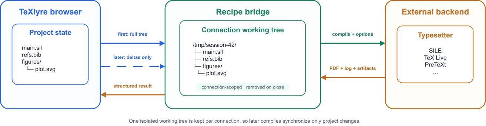
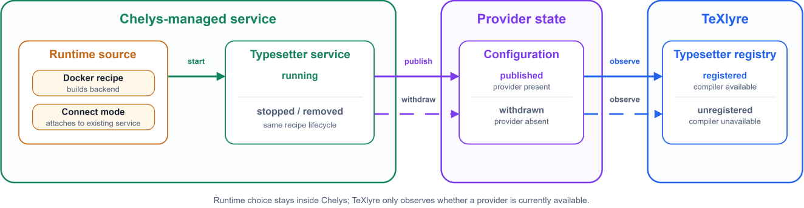

:::info[Part of the NGI0 Core roadmap]

This post reports on Task 5 of TeXlyre's NGI0 Commons grant. For the full project roadmap, see [TeXlyre joins NGI0 Commons](/blog/nlnet-ngi0-funding-overview).

:::

TeXlyre can now compile projects with typesetting systems running on the user's machine. A typesetter is exposed as a compile service, in that TeXlyre sends the project files and compile options, the service runs the selected tool (typesetter or document authoring compiler), then returns the log and generated output. Chelys then installs and manages these services through its recipe system.

The same interface is used by SILE, TeX Live (LaTeX), PreTeXt, ConTeXt, and the other typesetter recipes. TeXlyre sees each one as a compiler provider alongside its built-in browser compilers.

## Background

TeXlyre's support for WebAssembly-based Typst and LaTeX typesetting engines satisfies most common use cases. However, certain packages depend on libraries or environments that cannot practically be bundled in a browser environment. For example, LaTeX's SVG support relies on Inkscape, while some Typst packages and templates rely on system fonts unavailable to the WebAssembly engine. Similarly, many alternative typesetting systems depend on native binaries or language runtimes that are impractical to port and maintain in WebAssembly. Supporting them through external execution environments is therefore more feasible than running every typesetting backend directly in the browser.

TeXlyre represents each external backend through a provider, which describes how the editor can interact with it, including the supported project type, input files, output formats, compile controls, and transport address. The corresponding recipe defines how that backend is installed, configured, and executed in the external environment. This allows SILE, PreTeXt, TeX Live, and other backends to share the same editor-side compilation workflow, keeping the editor agnostic to backend-specific execution details.

The work spans three repositories. Each link below shows the full diff for that repository's contribution to this task.

- [chelys](https://github.com/TeXlyre/chelys/compare/c973a9a%5E...nlnet_032026_T5-external-compile): the `typesetter` plugin type and its integration with the Chelys recipe lifecycle.
- [texlyre](https://github.com/TeXlyre/texlyre/compare/d2bc132%5E...nlnet_032026_T5-external-compile): compiler registration, external compile dispatch, file synchronization, controls, and output handling.
- [chelys-recipes](https://github.com/TeXlyre/chelys-recipes/compare/188f431%5E...nlnet_032026_T5-chelys-typesetter-recipes): the shared compile bridge and the typesetter recipes.

## Milestone 5a: Compile dispatch, file transfer, and PDF retrieval

Unlike in-browser typesetters, TeXlyre has no direct control over the execution pipeline of external backends. At the same time, from the editor's perspective, the behavior and procedures should remain identical regardless of whether compilation is performed locally or externally. To compile a project successfully, an external backend therefore needs access to the complete project file tree, including scripts, bibliographies, images, and other binary assets.

TeXlyre constructs a temporary working tree that mirrors the project's directory structure and transfers it to the external environment over WebSocket. Each project instance receives an independent working directory, preventing files and generated artifacts from leaking between project instances or connections. The recipe bridge can then invoke the configured backend for this reconstructed project and return the resulting output, logs, and auxiliary files to TeXlyre in a uniform structure. This allows the editor to treat external and local compilation in a similar fashion.

Once compilation is complete, the generated outputs, such as a PDF and other requested artifacts, are transmitted back to the originating TeXlyre instance together with the compiler log and auxiliary files generated during the run. TeXlyre can then pass the main output through the same rendering and preview pipeline used by its in-browser typesetters.

*A connection-scoped working tree mirrors the project inside the recipe bridge; the first compile transfers the full tree and later compiles synchronize only the files that changed.*

A provider can optionally enable incremental file synchronization. After an initial project transfer, further compile requests send only files that have changed or have been removed, while the bridge keeps the reconstructed working tree for the lifetime of the connection. Once the connection closes, the working directory is discarded, and a new connection begins with a fresh project state. For example, given a SILE project, the first compile transfers `main.sil` together with its project assets. If only one source file changes afterwards, the next request synchronizes that file before compiling with SILE again.

:::info[Incremental file synchronization]

Currently, incremental synchronization operates on the complete file, meaning that changing a single character in the editor would retransmit the entire text document.

:::

Providers may also define compile-time controls that are exposed in TeXlyre's interface. The TeX Live provider, for instance, provides an engine selector for pdfLaTeX, LuaLaTeX, XeLaTeX, pLaTeX, and upLaTeX. The selected value is passed with the compile request, enabling a single external backend to support multiple compilation modes without requiring backend-specific handling in the editor.

## Milestone 5b: Typesetting engine lifecycle in Chelys

In [Milestone 4a](/blog/chelys-lsp-bridge), we introduced the recipe manager used to install and supervise local service providers. In this task, we extend the same lifecycle to `typesetter` recipes, allowing external typesetting backends to be installed, started, stopped, updated, and removed through Chelys.

When a typesetter service starts, Chelys publishes its provider configuration through the state shared with TeXlyre. TeXlyre observes this state and registers the corresponding typesetting compiler. When the service is stopped or removed, the provider is withdrawn and the compiler becomes unavailable again. Compiler availability in the editor therefore follows the actual state of the service without requiring a separate lifecycle in TeXlyre.

*Starting a typesetter recipe publishes its provider configuration to the shared state, which TeXlyre observes to register or withdraw the corresponding compiler.*

The backend runtime remains encapsulated by the recipe. A Docker recipe provides the full typesetting environment, whereas connect mode can attach to a compatible backend service that is already running. Both expose the same provider interface to TeXlyre, letting the editor-side compilation path remain agnostic of the service and how it is run or deployed.

In [Task 3](/blog/chelys-peer-to-peer-tools), we further extend this service model by enabling compatible Chelys services (tools) to be offered to collaborators over WebRTC.

## Acknowledgements

This work was funded by [NLnet Foundation](https://nlnet.nl/project/TeXlyre/) as part of the TeXlyre project.
