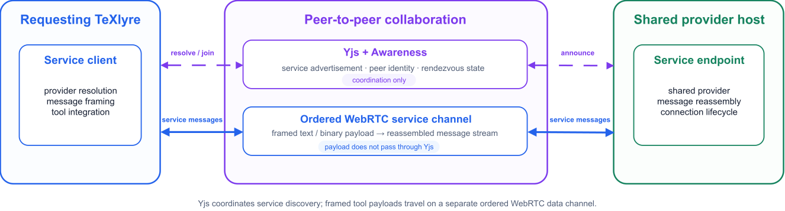
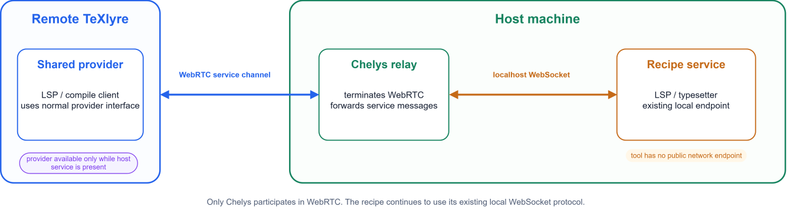
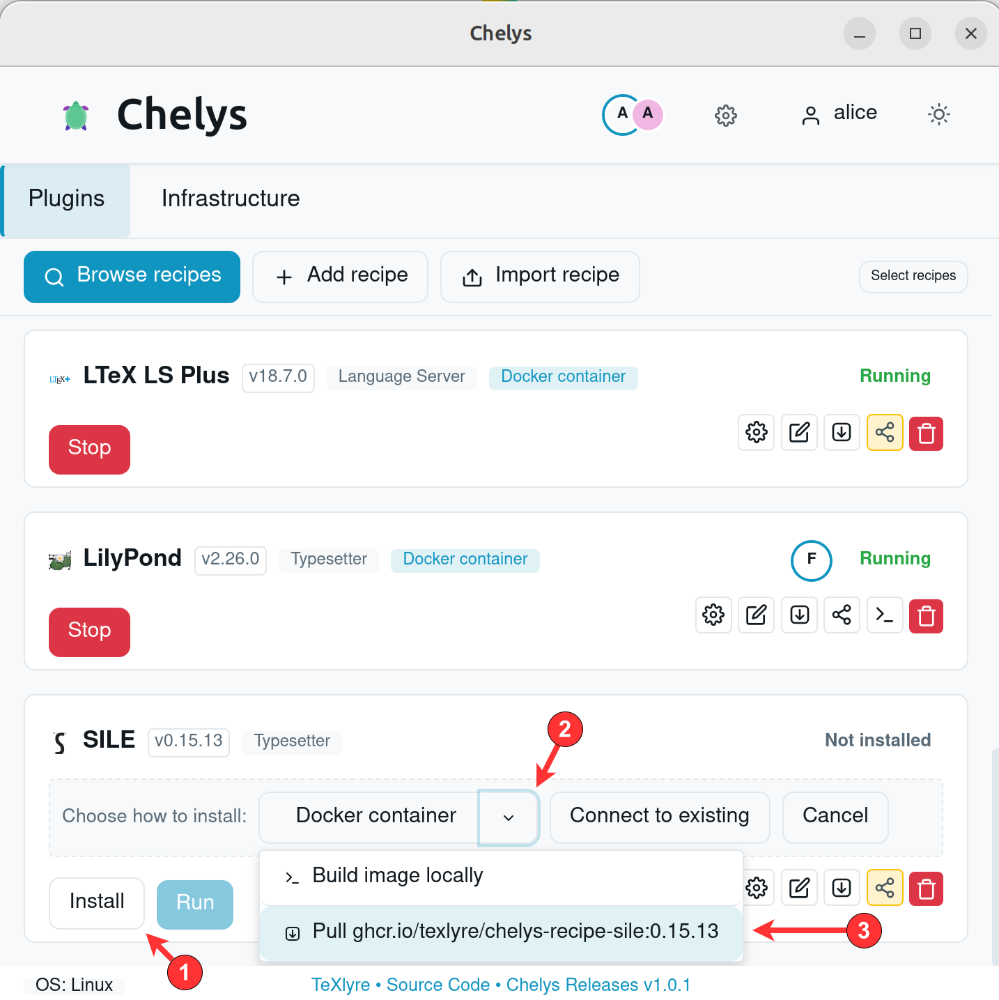
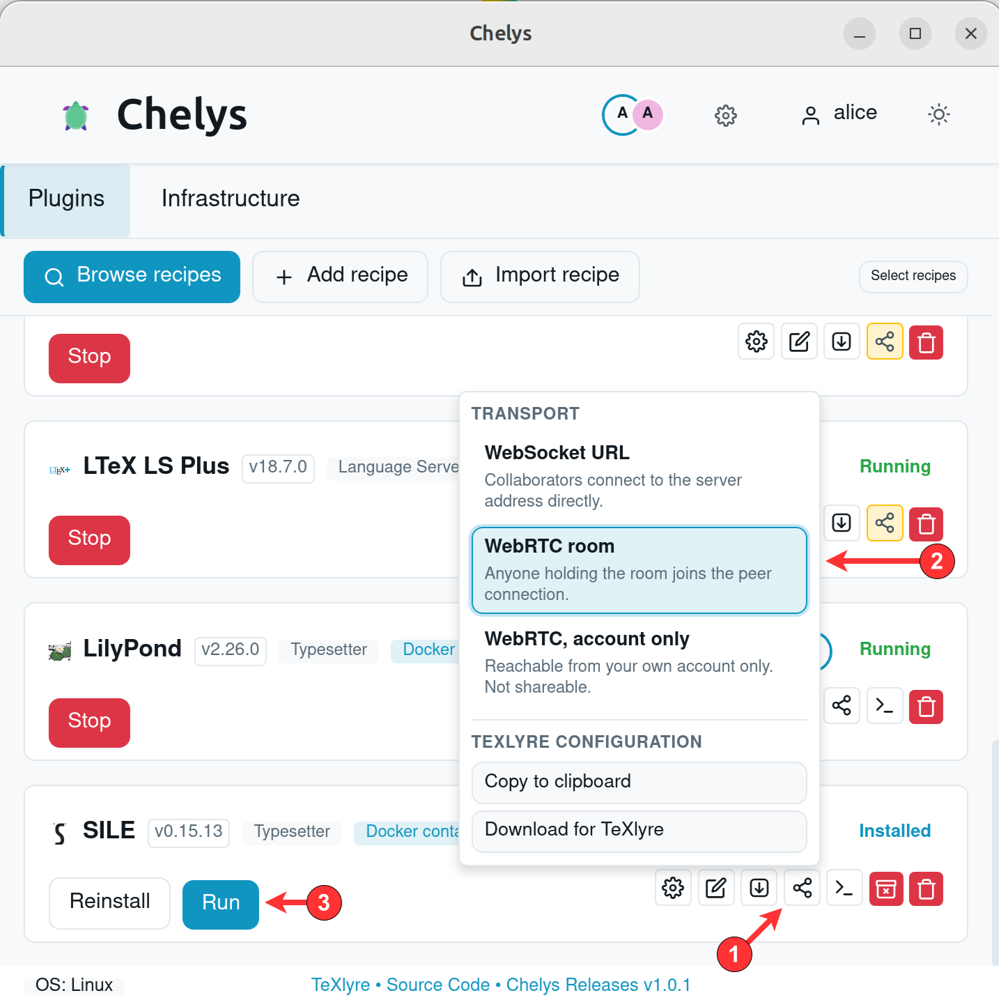
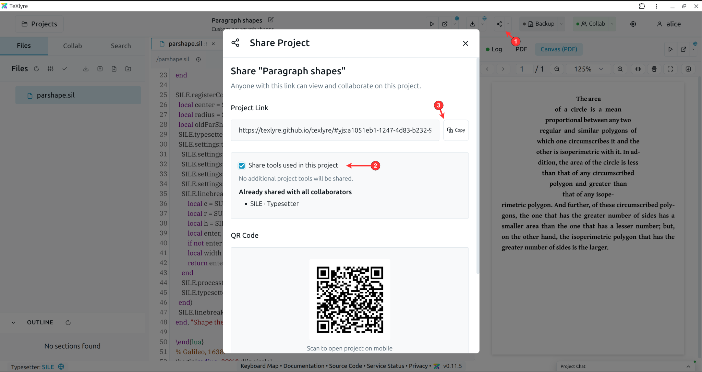
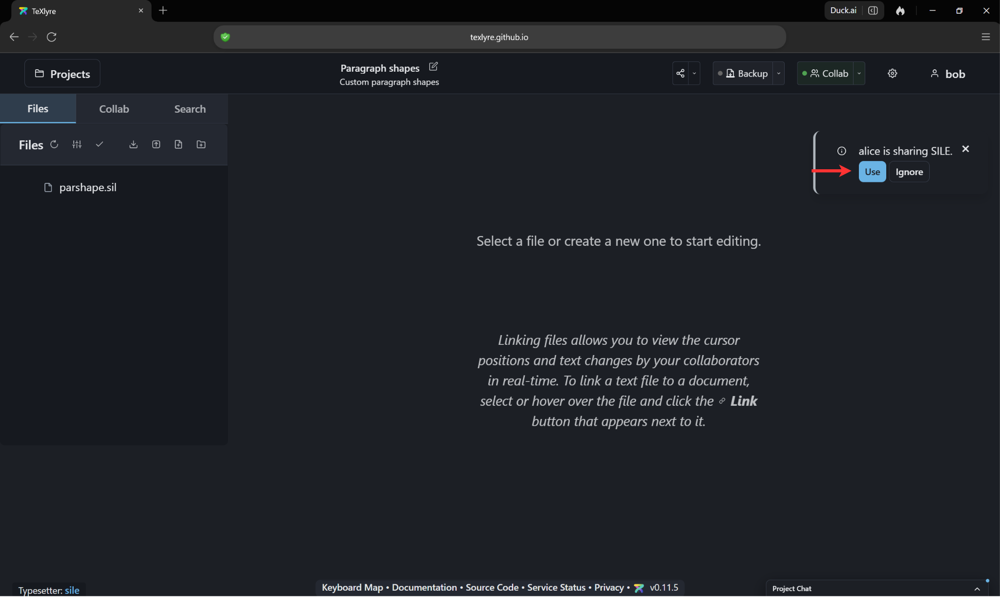
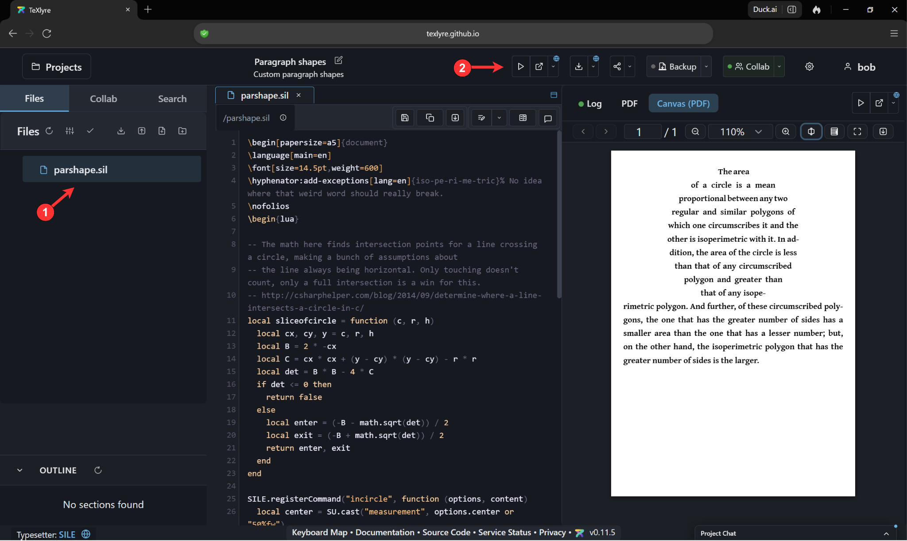
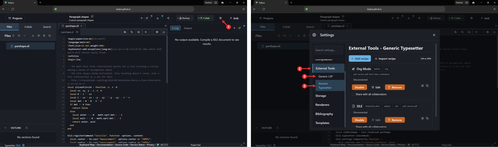

:::info[Part of the NGI0 Core roadmap]

This post reports on Task 3 of TeXlyre's NGI0 Commons grant. For the full project roadmap, see [TeXlyre joins NGI0 Commons](/blog/nlnet-ngi0-funding-overview).

:::

Chelys tools can now be shared with collaborators over WebRTC. A service running on one user's machine can be exposed to another TeXlyre instance in the same collaborative project while the tool remains local to its host. TeXlyre can therefore interact with both local and remote providers through the same editor-side route, whereas Chelys handles the relay between a remote connection and the recipe's local endpoint, bridging WebRTC with WebSocket-connected recipes.

## Background

In [Task 2](/blog/chelys-lsp-bridge), we introduced support for connecting TeXlyre to local language servers over LSP through WebSocket endpoints. This is functional when TeXlyre and Chelys are running on the same machine or when the WebSocket endpoint is made public. However, the local endpoint cannot be accessed directly by other collaborators in the project when neither condition is fulfilled.

TeXlyre already uses Yjs over WebRTC for peer-to-peer project collaboration. External tools, however, follow a different communication pattern from document synchronization. Requests need to reach a specific provider, after which responses must return to the originating client. Additionally, larger messages may need to be split and reconstructed during transport. In this task, we therefore add a separate service for external tool transport. This involves the creation of a shared WebRTC and WebSocket wrapper for discovery, framing, and bidirectional communication specific to such tools, while the existing collaboration infrastructure for peer coordination remains unchanged.

The work spans two repositories. Each link below shows the full diff for that repository's contribution to this task.

- [chelys](https://github.com/TeXlyre/chelys/compare/8871fb6%5E...nlnet_032026_T3-webrtc-tools): the native WebRTC service bridge, recipe relay, and remote provider lifecycle.
- [texlyre](https://github.com/TeXlyre/texlyre/compare/98eab37%5E...nlnet_032026_T3-webrtc-tools): service framing, WebRTC and WebSocket transports, provider discovery, and project-level tool sharing.

## Milestone 3a: Service serialization and transport

Local and shared external tool providers use the same service transport abstraction. Messages can contain text or binary data and can exceed the size suitable for a single transport message, as is also the case with Yjs updates. TeXlyre therefore splits larger payloads into bounded frames, transmits them in sequence, and reconstructs the original message at the receiving end. Integrations above this layer observe only the resulting message stream and remain agnostic to the transport.

The transport itself differs depending on where the provider is located. Local providers communicate over WebSocket, whereas remote providers use a WebRTC data channel. On the WebRTC side, the service channel uses SCTP over DTLS for ordered and reliable message delivery, while TeXlyre's service framing operates above this transport layer to handle application-level payload sizes and reconstruction, splitting data messages into 16 KiB chunks.

*Yjs and awareness carry only discovery and peer coordination, while framed tool payloads travel over a separate ordered WebRTC data channel and are reassembled at the receiving end.*

Yjs and awareness states are used separately to announce available services and coordinate the peers involved in establishing a connection. Tool payloads, including files, commands, and responses, do not pass through the Yjs document synchronization stream. This keeps service communication independent from project synchronization while allowing both to use the same peer-to-peer collaboration infrastructure.

## Milestone 3b: WebRTC relay for remote tool access

In Milestone 3a, we built the transport structure needed to reach a remote provider, while in Milestone 3b, we make an existing Chelys service (backend tool) available through that transport. The recipe continues to expose the same local WebSocket endpoint used when TeXlyre and Chelys run on the same machine. For remote access, however, Chelys exposes that service through WebRTC and relays messages between the remote connection and the recipe's local WebSocket endpoint.

*The remote instance connects over WebRTC to Chelys on the host machine, which forwards service messages to the recipe's unchanged localhost WebSocket endpoint.*

The collaboration state announces which services, together with their providers, a host makes possible to share. A remote TeXlyre instance can then register a compatible shared provider alongside its local providers, while the corresponding tool remains attached only to Chelys on the host machine. Provider availability follows the host service: if the recipe is stopped or the host leaves the collaboration session, the shared provider is removed and its corresponding service connection is closed.

For example, Alice can run `ltex-ls-plus` through Chelys and expose it to a collaborative project. Bob's TeXlyre instance can then register and use that provider as if it were locally available, while Chelys transparently relays its requests to Alice's local `ltex-ls-plus` endpoint. If Alice keeps her Chelys instance running while closing TeXlyre, Bob can still connect to language server and typesetter services provided by Alice. Alice and Bob only need to be simultaneously present when the provider configuration is initially announced through the collaboration state.

WebRTC connection establishment still relies on the configured signaling infrastructure. However, this is only used to establish the peer connection and does not require the corresponding tool's WebSocket connection to be forwarded or made publicly available across the network in order to be reachable.

The same relay mechanism is also used by the external typesetters introduced in [Task 5](/blog/chelys-local-typesetters). Shared SILE or TeX Live providers can therefore transfer synchronized project files, compile requests, logs, and generated output through the same service connection without modifying the typesetter protocol.

## Walkthrough: sharing a local typesetter with a collaborator

The following steps walk through exposing a Chelys typesetter to a collaborator, using the SILE recipe as the example provider. Alice hosts the typesetter and Bob compiles against it from another TeXlyre instance.

1. On Alice's machine, install Chelys and pair it with her TeXlyre identity, following the [walkthrough in the Task 2 report](/blog/chelys-lsp-bridge).

2. In Chelys, open **Browse recipes**, add the SILE recipe, and install it as a Docker container (click the dropdown and choose `ghcr.io...` to download a pre-built Docker image instead for a quicker install).

   

3. Before starting the service, switch its transport from the local WebSocket endpoint to a WebRTC room. The transport is resolved when the service starts, so a running service has to be stopped and started again for a change to take effect.

   

4. Click **Run**. Chelys starts the SILE backend, joins the configured room, and relays the room's service messages to the recipe's local endpoint.

5. In TeXlyre, Alice opens a SILE project ([download example](https://sile-typesetter.org/examples/book.sil) and upload it to TeXlyre SILE project), selects the shared services to offer in it, and sends the collaboration link to Bob.

   

6. Bob opens the shared project. SILE appears in his compiler list next to the built-in browser compilers, marked as hosted by Alice. Clicking `use` in the approval toast allows the tools shared by Alice to be used for current and other projects where applicable.

   

7. Bob compiles `parshape.sil`. The project files are synchronized to Alice's machine over the service channel, SILE runs there, and the PDF and log are returned to Bob's preview pane.

   

8. If Alice closes the TeXlyre window and keeps Chelys running, the provider remains available to Bob who can still compile using SILE. 

9. Shared tools can be reviewed and revoked from two places. **Collab → Tools** opens the per-project **Shared Tools** dialog, showing tools offered by collaborators with a `Using`/`Ignore` toggle and, under **Shared by me**, the option to share the tools used in the current project.

   

   **Settings → External Tools** manages the same providers account-wide, where a shared entry such as SILE can be disabled (TeXlyre account retains recipe but becomes inactive), edited, removed, or offered to all collaborators regardless of project.

   

## Acknowledgements

This work was funded by [NLnet Foundation](https://nlnet.nl/project/TeXlyre/) as part of the TeXlyre project.
