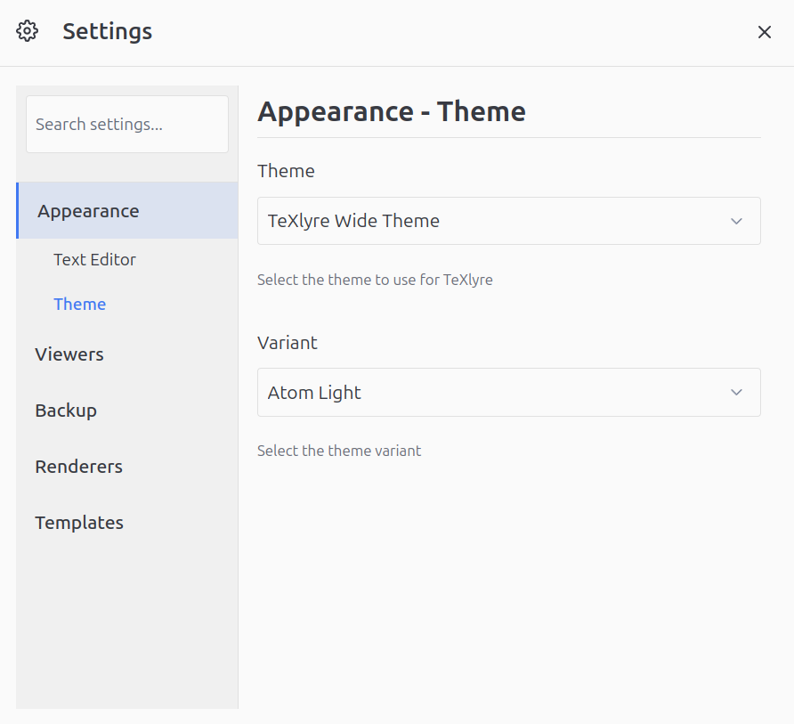
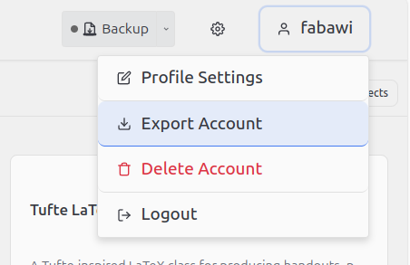
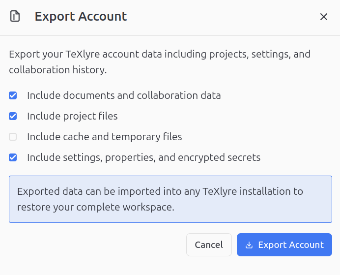
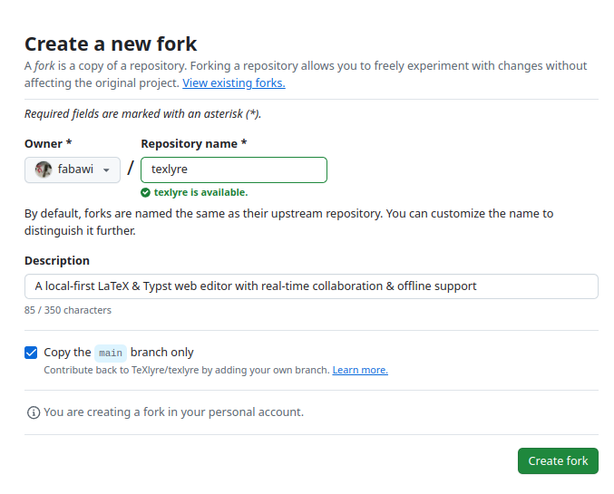
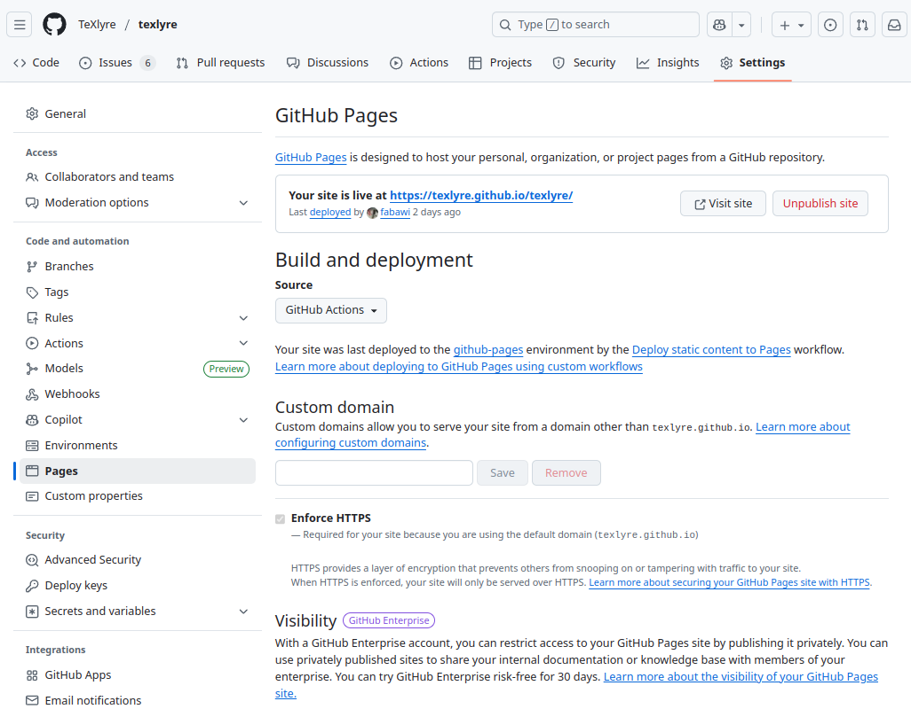
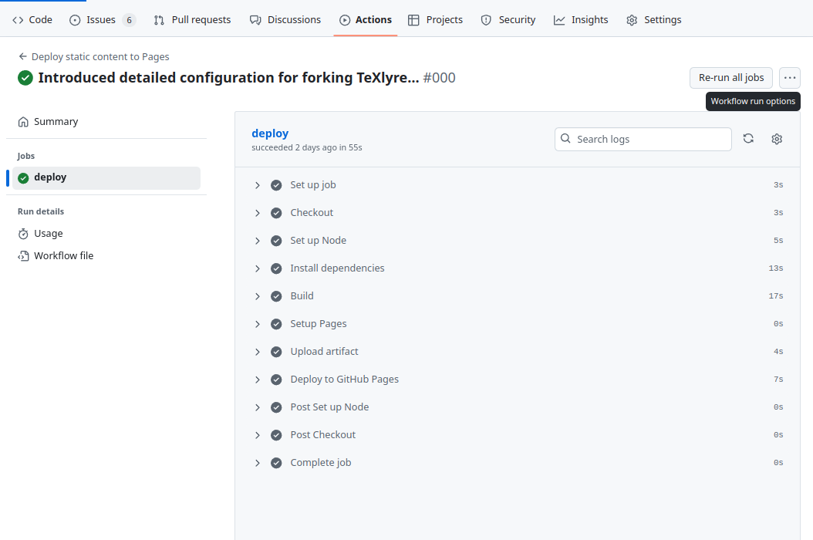

# Configuration

TeXlyre uses a centralized configuration system that generates runtime files from a single source of truth: `texlyre.config.ts`.

## Configuration Files

### Source Configuration

**`texlyre.config.ts`** - The primary configuration file defining all application settings, properties, and plugin registrations. This file serves as the single source of truth for your TeXlyre instance.

### Generated Files

The following files are **automatically generated** from `texlyre.config.ts`:

- **`plugins.config.js`** - Plugin registry used at runtime
- **`userdata.json`** - Default user settings and properties
- **`userdata.local.json`** - Local development overrides (when `userdata.local` is defined)

:::danger Automatic Overwrites

Running `npm run start` or `npm run generate-configs` will **completely overwrite** the following files:

- `plugins.config.js`
- `userdata.json`
- `userdata.local.json`

Any manual changes to these files will be lost. Always edit `texlyre.config.ts` instead.

:::

## Configuration Structure

### Basic Metadata

```typescript
const config: TexlyreConfig = {
  title: 'TeXlyre',
  tagline: 'A local-first LaTeX & Typst collaborative web editor',
  url: 'https://texlyre.github.io',
  baseUrl: '/texlyre/',
  organizationName: 'texlyre',
  projectName: 'texlyre',
  favicon: '/src/assets/images/TeXlyre_notext.png',
  // ...
};
```

### Plugin Configuration

Register plugins by category. All plugin paths are relative to the `extras` directory:

```typescript
plugins: {
  collaborative_viewers: ['bibtex'],
  viewers: ['bibtex', 'image', 'pdf'],
  renderers: ['pdf', 'svg', 'canvas'],
  loggers: ['latex_visualizer', 'typst_visualizer'],
  lsp: [],
  backup: ['github'],
  themes: ['texlyre_slim', 'texlyre_wide', 'texlyre_mobile'],
}
```

### User Data Configuration

Define default settings and optional local overrides:

```typescript
userdata: {
  default: {
    settings: {
      editorFontSize: 'base',
      editorFontFamily: 'monospace',
      // ...
    },
    properties: {
      global: {
        sidebarWidth: 502,
        // ...
      },
    },
    secrets: {},
  },
  mobile: {
    settings: {
      themePlugin: 'texlyre-mobile-theme',
      // ...
      },
    },
  },
  local: {
    settings: {
      latexTexliveEndpoint: 'http://localhost:5004',
      // ...
    },
  },
}
```

## Generating Configuration Files

### Development

Generate configuration files during development:

```bash
npm run generate-configs
```

This command:
1. Reads `texlyre.config.ts`
2. Generates `plugins.config.js`
3. Generates `userdata.json` from `default` settings
4. Generates `userdata.local.json` by merging `default` with `local` overrides
5. Generates `userdata.mobile.json` by merging local with mobile and is used when a mobile browser is detected
6. Updates `vite.config.ts` with the correct `baseUrl`
7. Updates `index.html` with title and favicon

### Production Build

The `start` script automatically runs configuration generation:

```bash
npm run start
```

This executes `generate-configs` before building the application.

## Exporting Custom User Data

You can create custom `userdata.json` files from your TeXlyre instance:

### Step 1: Configure Settings

Customize your settings and properties within the TeXlyre application to match your preferred configuration.



### Step 2: Export Account Data

1. Click your profile icon in the top-right corner
2. Select **Export Account** from the dropdown menu



### Step 3: Include Settings

In the export dialog, ensure **"Include settings, properties, and encrypted secrets"** is checked.



### Step 4: Extract Configuration

The downloaded ZIP file contains `userdata.json` in the root directory. Extract this file to use as your custom configuration.

:::warning Manual Secret Cleanup

The exported `userdata.json` includes encrypted secrets. You must manually set the `secrets` field to an empty object:

```json
{
  "settings": { /* ... */ },
  "properties": { /* ... */ },
  "secrets": {}
}
```

:::

:::danger Configuration Override

Placing a custom `userdata.json` in your repository will be **overwritten** when running:

- `npm run start`
- `npm run generate-configs`

To preserve custom configurations, update `texlyre.config.ts` instead.

:::

## Forking and Deployment

### GitHub Pages Deployment

When forking TeXlyre for GitHub Pages deployment, the configuration generation process runs automatically.

#### Step 1: Fork Repository

Fork the TeXlyre repository to your GitHub account.



#### Step 2: Enable GitHub Pages

Navigate to repository **Settings** → **Pages** and configure the deployment source.



#### Step 3: Configure texlyre.config.ts

Update `texlyre.config.ts` with your deployment details:

```typescript
const config: TexlyreConfig = {
  title: 'My TeXlyre Instance',
  url: 'https://yourusername.github.io',
  baseUrl: '/your-repo-name/',
  organizationName: 'yourusername',
  projectName: 'your-repo-name',
  // ...
};
```

#### Step 4: Automatic Build Process

The GitHub Actions workflow automatically:

1. Runs `npm run generate-configs`
2. Overwrites `plugins.config.js`, `userdata.json`, and `userdata.local.json`
3. Builds the application
4. Deploys to GitHub Pages



:::danger Production Configuration

The deployment process **always** regenerates configuration files from `texlyre.config.ts`. Manual edits to generated files will not persist through deployments.

:::

### Custom Domain Configuration

For custom domains, update the `url` field in `texlyre.config.ts`:

```typescript
const config: TexlyreConfig = {
  url: 'https://your-custom-domain.com',
  baseUrl: '/',
  // ...
};
```

## Configuration Workflow

### Recommended Workflow

1. **Edit** `texlyre.config.ts` with desired changes
2. **Run** `npm run generate-configs` to update generated configuration files
3. **Preview** changes locally with `npm run dev`
4. **Commit** both `texlyre.config.ts` and generated files
5. **Deploy** using `npm run start` or GitHub Actions

## Troubleshooting

### Configuration Not Applied

If configuration changes don't appear:

1. Verify `texlyre.config.ts` syntax is valid
2. Run `npm run generate-configs` manually
3. Clear browser cache and reload
4. Check browser console for configuration errors

### Plugin Not Loading

Ensure plugins are:

1. Registered in `texlyre.config.ts` under the correct category
2. Located in the `extras` directory with correct paths
3. Properly exported and implementing required interfaces

### Build Failures

If builds fail after configuration changes:

1. Validate TypeScript types in `texlyre.config.ts`
2. Ensure all referenced plugins exist
3. Check that `baseUrl` and other paths are valid
4. Review GitHub Actions logs for specific errors