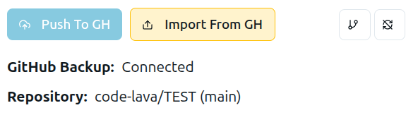
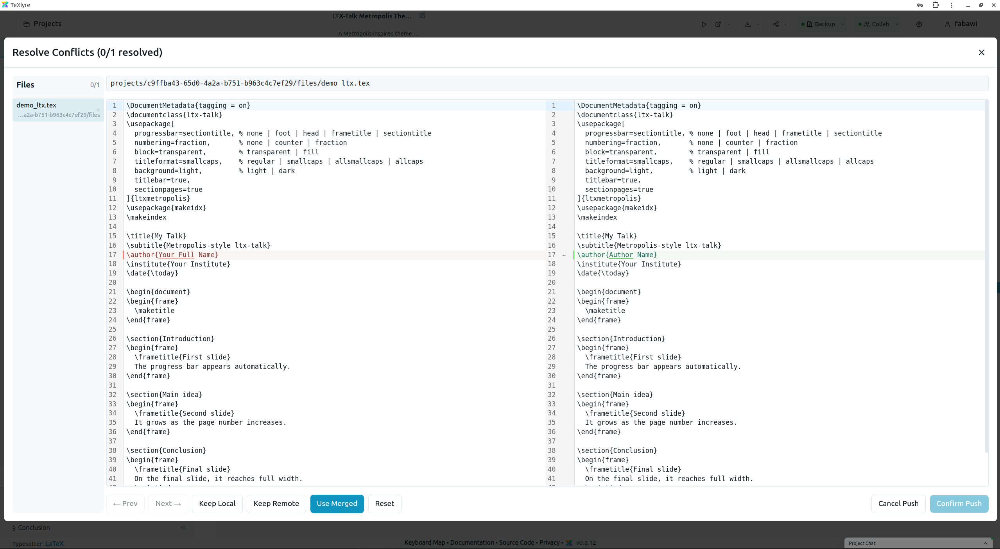
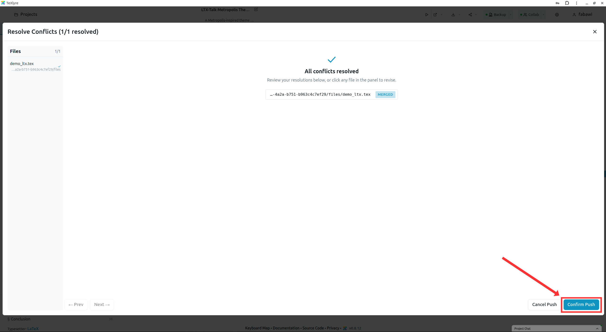

# Git Synchronization

TeXlyre can synchronize projects with Git repositories through its Git integrations, including GitHub, GitLab, Gitea, and Forgejo. Each integration connects TeXlyre to a repository and branch, then stores project data in a regular Git file layout that can also be edited outside TeXlyre.

A synchronized repository stores projects under `projects/{projectId}`. Each project contains its metadata in `metadata.json`, document metadata in `documents/.texlyre_metadata.json`, readable document files as `documents/{documentId}.txt`, collaborative document state as `documents/{documentId}.yjs`, file metadata in `files/.texlyre_metadata.json`, and uploaded or project files under `files/`.

:::danger[Project ID disclosure]

The `projectId` is part of TeXlyre’s project addressing and should not be shared with people who are not authorized to access the project. When a project is shared online, a share link that includes or reveals this identifier may allow access to the project files while the project is available online.

:::

This means a TeXlyre project is not locked inside the application. After pushing to one of the supported Git integrations, you can clone the repository, edit the readable text files or project files in another editor, commit those changes, and then return to TeXlyre. On the next TeXlyre synchronization, the Git integration compares the repository state with the local TeXlyre state and imports or merges the changes.

**Push** sends the current TeXlyre project state to the selected Git branch. TeXlyre checks which serialized files changed, skips files whose Git hashes already match the repository, and commits only the required creates, updates, and deletions. If the remote branch changed since the last sync, TeXlyre checks for conflicts before completing the push.

**Import** reads the selected branch and applies the repository state back into TeXlyre. It can restore missing projects, update existing projects, import documents and files, and restore deleted-file markers. Because import applies the remote state locally, it can overwrite local changes that have not been pushed first.

By default, a successful push is followed by an automatic import when **Import After Push** is enabled in the Git integration settings. This push-then-import flow is the recommended synchronization path: the push preserves local changes, handles remote conflicts when needed, and the import refreshes TeXlyre from the final committed repository state.

When both TeXlyre and the remote repository changed the same file, TeXlyre performs a three-way merge. It compares the last synchronized version, the current local version, and the current remote version. If only one side changed, that side is used. If both sides changed different parts of a text file, TeXlyre merges them automatically. If both sides changed the same part, TeXlyre opens the merge dialog so you can keep the local version, keep the remote version, or use a merged result.

Binary files cannot be merged line by line, so TeXlyre asks you to choose either the local or remote version when both changed. Metadata and related document state are then reconciled from the chosen resolutions where possible.

When editing synchronized files outside TeXlyre, prefer editing the readable `.txt` document files or regular project files, then commit those changes through Git. On the next TeXlyre push and import, compatible text changes can be merged if conflicts are detected.

:::warning[Yjs document state]

The `.yjs` files store collaborative editor state. If you modify only a document’s corresponding `.txt` file outside TeXlyre, the related `.yjs` state may be regenerated or overwritten during synchronization so it matches the resolved text content.

:::