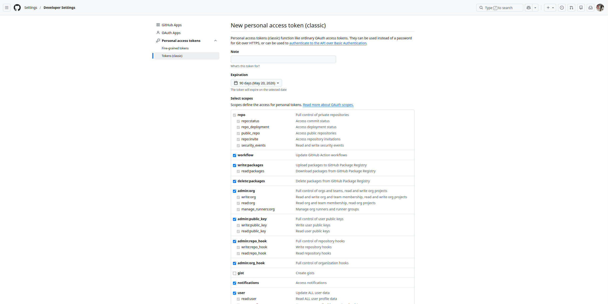

# GitHub

TeXlyre can back up your projects to GitHub repositories using a personal access token. Tokens are stored encrypted in your browser's local storage and are never transmitted to external servers.

## Generating a Token

Navigate to [GitHub → Settings → Developer Settings → Personal access tokens → Tokens (classic)](https://github.com/settings/tokens).

Click **Generate new token**, then select **Generate new token (classic)**.

Enter a descriptive note such as `TeXlyre` and set an expiration that matches your usage needs.

### Required Scopes

Under **Select scopes**, enable the following:

| Scope | Purpose |
|---|---|
| `repo` | Full control of private repositories |
| `workflow` | Update GitHub Actions workflow files |
| `write:packages` | Upload packages to GitHub Package Registry |
| `delete:packages` | Delete packages from GitHub Package Registry |

Click **Generate token** and copy the token immediately — GitHub will not display it again.

## Adding the Token to TeXlyre

1. Open TeXlyre and navigate to **Backup → GitHub**.
2. Paste your token into the **GitHub Personal Access Token** field.
3. Click **Connect**.
4. Select a **repository** (preferably private; must already contain at least one file, e.g. `README.md`, as TeXlyre does not create repositories).
5. Click **Next**.
6. Select a **branch** and click **Connect**.
7. Enter your TeXlyre account password to securely store your token.
8. Click **Unlock**.

:::note Changing the Endpoint
To change the connected repository endpoint, navigate to **Settings → Backup → GitHub**.
:::

:::warning Token Expiry
When your token expires, backups will stop silently. Regenerate your token on GitHub and update it in TeXlyre settings before the expiry date.
:::
