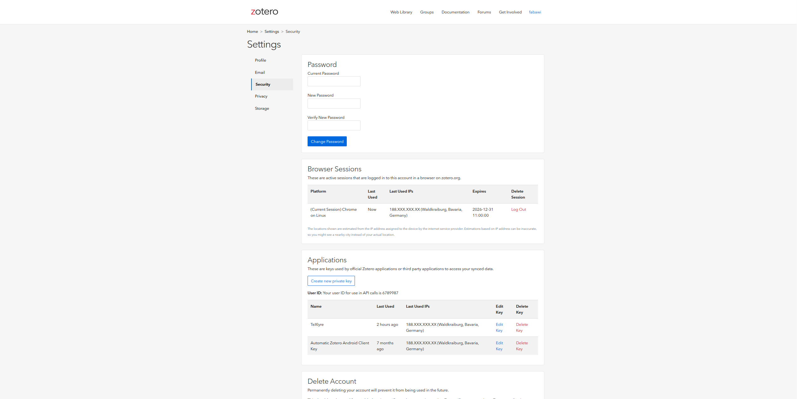

# Zotero

TeXlyre can connect to your Zotero library to import references directly into your documents. The Zotero integration is accessible from the editor header when working on LaTeX, Typst, and BibTeX files. Your API key and User ID are stored encrypted in your browser's local storage and are never transmitted to external servers.

## Finding Your User ID

Your **User ID** is a numeric identifier distinct from your Zotero username. You must provide it alongside your API key.

Navigate to [Zotero → Settings → Security](https://www.zotero.org/settings/security).

Scroll to the **Applications** section. Your User ID is displayed above the list of API keys as:

> *Your user ID for use in API calls is `XXXXXXX`*

Copy this number. Do not use your Zotero username — the API requires the numeric ID.

## Generating an API Key

On the same [Security settings page](https://www.zotero.org/settings/security), click **Create new private key**.

Enter a **Key Name** such as `TeXlyre`.

### Required Permissions

Configure the following permissions:

**Personal Library**

| Permission | Setting |
|---|---|
| Allow library access | ✅ Enabled |
| Allow notes access | Optional |
| Allow write access | ✅ Enabled |

**Default Group Permissions**

Set to **Read/Write** to allow TeXlyre access to all current and future group libraries, or configure per-group permissions under **Specific Groups** if you prefer finer control.

Click **Save Key** and copy the key immediately.

## Adding the Credentials to TeXlyre

The Zotero integration is accessible directly from the editor header when a LaTeX, Typst, or BibTeX file is open.

1. Click the **Zotero** button in the editor header.
2. Enter your numeric **User ID** (not your username) in the **User ID** field.
3. Paste your key into the **API Key** field.
4. Click **Connect**.
5. Select the **library** you want to use.
6. Enter your TeXlyre account password to securely store your credentials.
7. Click **Unlock**.

:::warning User ID vs. Username
The **User ID** is a numeric value found in **Settings → Security → Applications**, not your Zotero login username. Using your username instead of the ID will cause authentication to fail.
:::
